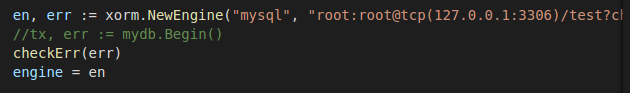
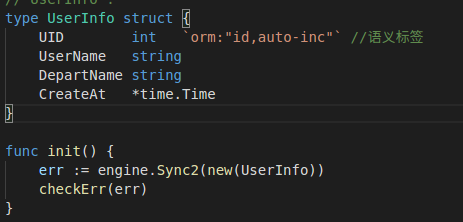
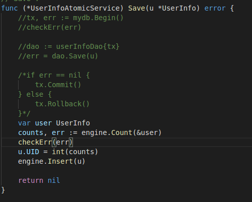
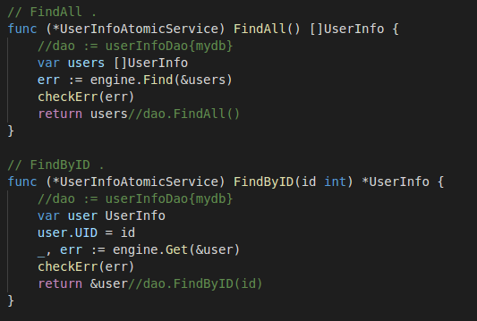
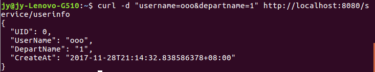
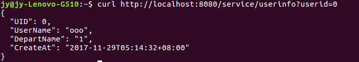
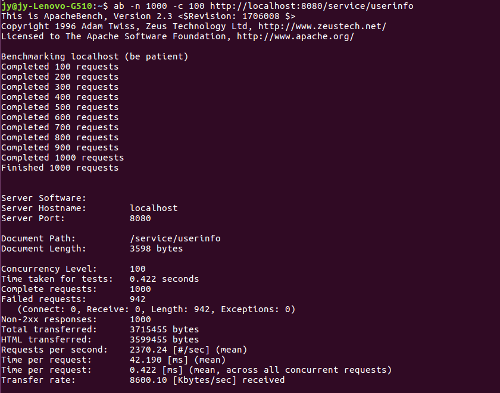
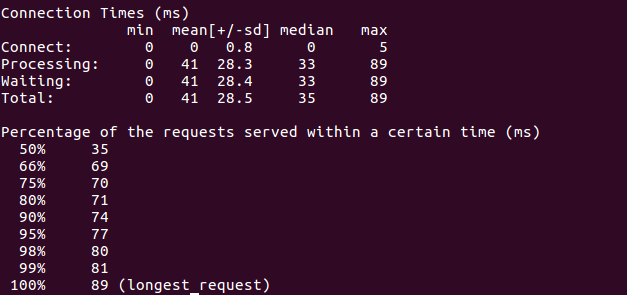

#### golang 构建数据服务  
##### 1.使用 xorm 或 gorm 实现本文的程序   
个人选择了xorm实现该程序.关键代码如图所示  
创建管理引擎  
  
  
定义一个结构体和SYNC2数据库表结构  
  
通过engine调用对应的方法管理数据库  
  
  
测试结果  
  
  
##### 2.从编程效率、程序结构、服务性能等角度对比 database/sql 与 orm 实现的异同  
编程效率还是orm更快吧,毕竟不去调用database/sql的四个方法然后自己处理得到的返回值,orm还是相对方便一点.  
程序结构上也简化了,因为用不到dao.go,直接调用engine的方法就可以得到我们要的数据了  
服务性能应该是database/sql比较好,毕竟orm是牺牲性能获得易用性  
##### 3.orm 是否就是实现了 dao 的自动化？  
是吧,orm 使得我们不需要编写 dao 服务  
##### 4.使用ab测试性能  
  
  
